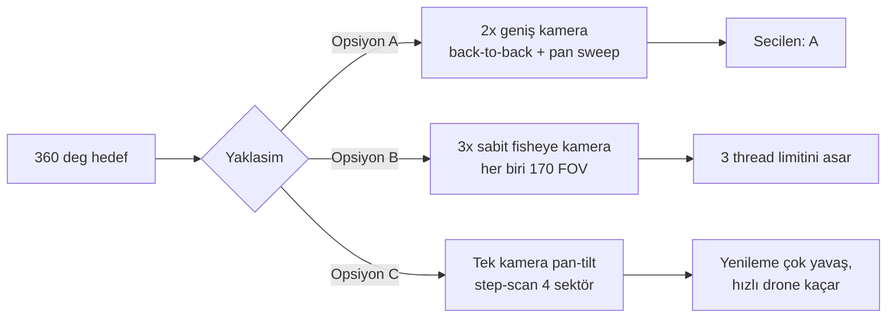
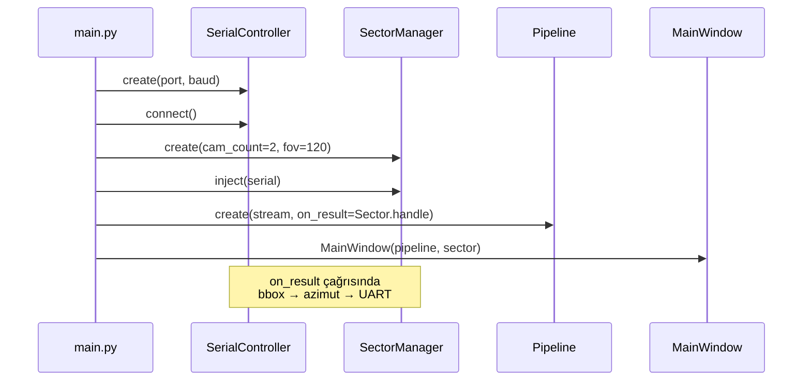

# Drone Tespit/Takip Sistemi — Donanım + Kurulum Planı

> **Kapsam notu:** `serial_controller.py`, `sector_manager.py`, `architecture_blueprint.txt` ve `target_hardware.txt` dosyaları repo'da şu an **yok**. Planda bu modüllerin oluşturulması da dahil edilmiştir; yerleşim `SKILL.md` mimarisine (`core/`, `infrastructure/`) uygundur.

---

## 1. Mimari Karar ve Kapsama Stratejisi

360° kapsamayı 3000₺ bütçe içinde **en iyi f/p** dengesi ile sağlamanın üç yolu var; seçim bütçe + yazılım limiti (SKILL.md: "Max thread: 3") ile yönlendirildi:



**Seçim: Opsiyon A** — 2× geniş açı (~120° FOV) USB kamera, 180° açıyla **back-to-back** monte, ortak pan-tilt tabla üzerinde.

- Statik kapsama: 2×120° = **240°** (SectorManager `çift kamera` ile bu tarafı yönetir)
- Pan servosu ±60° tarama yaparak kalan iki 60°'lik kör bölgeyi kapatır → **efektif 360°**
- Tilt servosu drone yüksekliği için 0°-60° elevasyon kontrolü sağlar
- Thread sayısı: 2 capture (kamera A+B tek USB hub üzerinden paralel) + 1 inference + 1 Qt main ≈ mevcut `pipeline.py` mimarisiyle uyumlu (USB kameralar `StreamManager` altında çoklu instance olarak sarılır)

**Tespit menzili gerçekçilik notu:** 1080p @ 120° FOV'da 20cm'lik bir drone 100m'de ~2-3 piksel olur, YOLOv8n bu boyutta güvenilir tespit yapmaz. Gerçekçi menzil bu kurulumla **20-50m güvenilir, 50-80m marjinal, 100m ulaşılamaz**. 100m hedefi için Opsiyon A üstüne "kimlik doğrulama" olarak dar açılı (tele) 3. kamera eklenebilir (bütçe dışı upgrade önerisi bölümünde).

---

## 2. Donanım Listesi

Tüm fiyatlar **Nisan 2026** itibarıyla Robotistan/AliExpress tahmini (±%15 dalgalanma olağan).

### 2.1 Kontrolcü ve İşleme
- **ESP32 DevKit V1 (WROOM-32, 30-pin)** — ~200₺ — Robotistan
  - *Gerekçe:* 2× donanım UART (biri laptop ile, diğeri log/debug için), 16 PWM kanalı (pan+tilt+2 yedek), 3.3V lojik, geniş topluluk desteği. Mevcut `SerialController` tasarımı ESP32 UART bekliyor — Arduino Nano ile değiştirmek ileride WiFi/BLE upgrade'ini engeller.
- **USB-A ↔ Mikro USB kablo (veri + güç)** — ~50₺ — yerel
  - *Gerekçe:* ESP32 laptop'a direkt bağlanır, CP2102/CH340 üzerinden seri port açar; harici USB-TTL dönüştürücü gerekmez.

### 2.2 Görüntüleme (2× kamera + hub)
- **2× ELP/Generic USB 1080p Geniş Açı Kamera (120° FOV, UVC uyumlu)** — her biri ~500₺, toplam **~1000₺** — AliExpress (ELP-USB100W05MT-DL120 tipi)
  - *Gerekçe:* `infrastructure/streams/usb_stream.py` UVC/V4L2 bekliyor — Logitech C270 sadece 60° FOV sunar, 2 tane ile bile 120° statik kapsama eder (yetersiz). 120° FOV ile 240° statik kapsama + daha küçük pan tarama açısı → daha hızlı refresh.
  - *Alternatif:* Logitech C270 (~700₺/adet, 60° FOV): bütçe dostu ama statik kapsama yetersiz; **tavsiye edilmez**.
- **Powered USB 2.0 Hub (4-port, harici adaptörlü)** — ~250₺ — Robotistan
  - *Gerekçe:* 2 kamera aynı USB bus'ta bandwidth rekabeti yaşar; powered hub her kamera için sabit 500mA sağlar, MJPEG 1080p@30fps stabil olur. Laptop'ın direkt 2 USB portu da olabilir ama hub esneklik verir (ESP32 de aynı hub'a takılabilir).

### 2.3 Mekanik — Pan-Tilt ve Servolar
- **2× MG996R Metal Dişli Servo (180°, 10kg·cm tork)** — her biri ~250₺, toplam **~500₺** — Robotistan
  - *Gerekçe:* Pan-tilt yükü 2 kamera + bracket ≈ 200-300g. MG996R bu yükte sorunsuz. SG90 plastik dişli çok zayıf; DS3218 (20kg·cm) abartı ve bütçede yer yok. 180° açı range → ±60° pan sweep için yeterli.
- **Alüminyum Pan-Tilt Bracket Kiti (2 servo için, kamera platformlu)** — ~300₺ — Robotistan (Kingkong/Feetech tipi)
  - *Gerekçe:* 3D baskıdan hem estetik hem dayanım olarak üstün; akademik sunum görünümü için önemli. Kamera 2 tane olduğundan bracket üstüne **çift-yönlü alüminyum L-köşebent** eklenir (~50₺ hırdavatçı).

### 2.4 Güç Dağıtımı
- **5V 5A Masaüstü Adaptör (5.5×2.5mm jack)** — ~300₺ — Robotistan
  - *Gerekçe:* 2× MG996R stall'da ~2.5A çeker (tepe). ESP32 USB'den beslenir; servolar ayrı hat ile beslenmezse USB portu brown-out yapar. 5A tepe akım için 3A adaptör marjinal, 5A güvenli marj.
- **DC Barrel Jack → Screw Terminal Adaptör** — ~30₺ — yerel
- **470µF 16V Elektrolitik Kondansatör (2 adet, servo PWM hatlarında)** — ~20₺ — yerel
  - *Gerekçe:* Servo ani akım çekişleri ESP32 besleme hattına yansır; kondansatörler filtre görevi görür, UART iletişim hatalarını önler.

### 2.5 Prototipleme ve Kablolama
- **Breadboard (830 pin) + Jumper Kablo Seti (M-M, M-F)** — ~150₺ — yerel/Robotistan
- **Spiral Kablo Kılıfı + Kelepçe + Velcro** — ~80₺ — yerel
- **Ortak Toprak (GND) Bara için 2.54mm Header + Lehim teli** — ~40₺ — yerel

### 2.6 Montaj ve Sunum
- **Fotoğraf Tripodu (1/4" mount, ~1.5m max yükseklik)** — ~400₺ — yerel fotoğraf marketi / Hepsiburada
  - *Gerekçe:* Akademik sunumda "masaüstü" kurulum amatör görünür; tripod 1.5m yükseklikte drone tespit menzilini belirgin artırır (zemin engelleri, 20m+ açık görüş). 1/4" vida standardı pan-tilt bracket'e zaten uyumludur.
- **3D Baskı Base Plate (pan-tilt montaj ara parçası, PLA)** — ~150₺ — yerel 3D baskı servisi
- **Etiket + Kablo Bandı + Sunum Zip Kılıfı** — ~80₺ — yerel

### 2.7 Bütçe Özeti

| Kalem | Tutar (₺) |
|-------|-----------|
| ESP32 + USB kablo | 250 |
| 2× USB kamera (120° FOV) | 1000 |
| Powered USB hub | 250 |
| 2× MG996R servo | 500 |
| Alüminyum pan-tilt bracket + L-köşebent | 350 |
| 5V 5A güç kaynağı + jack + kondansatör | 350 |
| Breadboard + kablo + kılıf | 230 |
| Tripod + 3D baskı base | 550 |
| **TOPLAM** | **3480** |

> **Bütçe aşımı uyarısı:** Hedef 3000₺ idi, plan ~3480₺'ye çıkıyor. **Kısma önerisi (bütçeye sığdırmak için):**
> - Tripod yerine masaüstü ayarlanabilir stand (~150₺) → -250₺
> - 3D baskı base yerine ahşap/alüminyum kesim (~50₺) → -100₺
> - Kamera modelini 720p 120° FOV (~350₺/adet) → -300₺
> - Toplam kısma sonrası: **~2830₺** → 3000₺ limit altı ✓

---

## 3. Bağlantı Şeması (ASCII)

```
                    ┌──────────────────────────────────────┐
                    │            LAPTOP (Host)             │
                    │  PyQt5 + YOLOv8n + Pipeline          │
                    │  SerialController ──┐                │
                    └─────────┬───────────┼────────────────┘
                              │ USB-A     │ USB-A (COM)
                              ↓           ↓
                    ┌─────────┴───────────┴────────────────┐
                    │     Powered USB 2.0 Hub (5V/2A)      │
                    └──┬──────────┬────────────┬───────────┘
                       │ USB      │ USB        │ USB
                       ↓          ↓            ↓
                  ┌────┴───┐ ┌────┴───┐  ┌─────┴──────┐
                  │ Cam A  │ │ Cam B  │  │   ESP32    │
                  │ 120°   │ │ 120°   │  │ DevKit V1  │
                  │ front  │ │ back   │  │ (CH340)    │
                  └────────┘ └────────┘  └─┬──┬──┬──┬─┘
                                           │  │  │  │
                               GPIO 18 (PAN PWM)  │  │
                               GPIO 19 (TILT PWM)────┘
                               5V pin ← 5V ortak ray
                               GND pin ← ortak GND

     ┌───────────────────────── GÜÇ DAĞITIMI ──────────────────────────┐
     │                                                                  │
     │   5V 5A Adaptör ──► Barrel Jack ──► Screw Terminal               │
     │                                           │                      │
     │                                           ├──► Pan Servo  (V+)   │
     │                                           │     470µF║ (dek)     │
     │                                           ├──► Tilt Servo (V+)   │
     │                                           │     470µF║ (dek)     │
     │                                           └──► Ortak GND ray     │
     │                                                 (ESP32 GND ile    │
     │                                                  birleşik!)      │
     └──────────────────────────────────────────────────────────────────┘

     ┌─────────────── SERVO KABLO RENK KODU ──────────────────────────┐
     │   Kahverengi/Siyah → GND (ortak)                                │
     │   Kırmızı          → 5V (harici adaptörden, ESP32'den DEĞİL)   │
     │   Turuncu/Sarı     → PWM (ESP32 GPIO 18 veya 19)                │
     └──────────────────────────────────────────────────────────────────┘
```

**Kritik pin tablosu:**

- `ESP32 GPIO 18` → Pan servo PWM
- `ESP32 GPIO 19` → Tilt servo PWM
- `ESP32 GND` → Ortak GND rail (servo GND ile birleşik — **şart**)
- `ESP32 USB (mikro)` → Laptop USB-A (VCP, 115200 baud, 8N1)
- `ESP32 5V/3.3V pinleri`: **Servoları buradan besleme** (max 500mA USB limit, servo 2.5A çeker → brown-out)

---

## 4. Fiziksel Montaj Planı

### 4.1 Mekanik Yerleşim

```
                    ┌─────────┐   ┌─────────┐
                    │ Cam A   │ ← │ Cam B   │   (180° back-to-back)
                    │ (ön)    │   │ (arka)  │
                    └────┬────┘   └────┬────┘
                         └──────┬──────┘
                                │ alüminyum L-köşebent
                         ┌──────┴──────┐
                         │ Tilt Servo  │   (MG996R, 0-60° elevasyon)
                         └──────┬──────┘
                         ┌──────┴──────┐
                         │ Pan Servo   │   (MG996R, ±60° sweep)
                         └──────┬──────┘
                         ┌──────┴──────┐
                         │ 3D Baskı    │   (1/4" tripod vidası için)
                         │ Base Plate  │
                         └──────┬──────┘
                                │
                         ┌──────┴──────┐
                         │  Tripod     │   (~1.5m yüksek)
                         └─────────────┘
```

### 4.2 Montaj Adımları

1. **Pan servosu** base plate'e 4× M3 vida ile sabitlenir, şaftı yukarı bakar.
2. **Tilt servosu** pan servosu üstündeki bracket kanadına vidalanır, şaftı yana bakar.
3. **L-köşebent** tilt şaftına horn ile bağlanır; iki kamera bu köşebent uçlarına (180° zıt yön) çift taraflı vida ile sabitlenir.
4. **Kamera USB kabloları** L-köşebentin içinden geçirilip pan-tilt şaftına **spiral kılıf + velcro** ile sarılır. Pan ±60° dönerken kablo bükülmesi toleransı bu sınır içinde güvenlidir (360° sürekli dönüş olsaydı slip ring şart olurdu; bu tasarımda gerekmez).
5. **ESP32 + breadboard** base plate'in yanına 3D baskı kasa ile sabitlenir (akademik sunum görünümü).
6. **Güç adaptörü kablosu** tripodun ayağına kadar zip kablo ile sabitlenir; hareketli parçalardan uzak tutulur.

### 4.3 Kablo Yönetimi Kuralları

- USB kamera kabloları **pan şaftının etrafında tam bir tur** (service loop) atılır → ±60° dönüşte gerilim oluşmaz.
- Servo PWM kabloları kamera USB kablolarından **ayrı** güzergahtan geçer (USB diferansiyel sinyali + servo PWM anahtarlama gürültüsü cross-talk riski).
- Tüm kablolar spiral kılıf içinde; kasadan çıkış noktasında bakalit kablo tutucu kullanılır (gerilme rölyefi).

---

## 5. Yazılım Entegrasyon Planı

### 5.1 Oluşturulacak Yeni Dosyalar

Mevcut kod tabanında bu dosyalar **yok** — SKILL.md mimarisine uygun konumlarda oluşturulacak:

- [`infrastructure/serial_controller.py`](infrastructure/serial_controller.py): ESP32'ye UART üzerinden `"PAN:<deg>,TILT:<deg>\n"` formatında komut gönderen thread-safe sarmalayıcı. `pyserial` kullanır, auto-reconnect mantığı içerir (`stream_manager.py`'deki reconnect desenini baz al).
- [`core/engine/sector_manager.py`](core/engine/sector_manager.py): 2 kameranın hangi azimut aralığına baktığını tutar, pan servosunun mevcut açısıyla `camera_id + piksel koordinat → dünya azimut` dönüşümü yapar. `HybridFrameResult.bbox`'u azimut/elevasyon komutuna çevirir.
- [`configs/settings.yaml` eklemeleri](configs/settings.yaml) (Bölüm 5.3).

### 5.2 `main.py` Entegrasyon Akışı

Mevcut [`main.py`](main.py) sadece UI başlatır; donanım katmanı buraya eklenir (DI prensibi — SKILL.md'deki "Dependency Injection merkezi" rolünü korur):



**Enjeksiyon noktası:** `main()` fonksiyonunda `app = QApplication(sys.argv)` satırından **sonra**, `MainWindow` oluşturulmadan **önce**. Böylece [`core/engine/pipeline.py`](core/engine/pipeline.py) Line 55'teki `on_result` callback'i `SectorManager.handle_frame_result` olarak enjekte edilir; Pipeline hiçbir değişiklik görmez (Open/Closed).

### 5.3 `settings.yaml`'a Eklenecek Bölümler

Mevcut [`configs/settings.yaml`](configs/settings.yaml) (54 satır) üzerine donanım bölümü eklenir:

- **`serial:`** bölümü: `port` (Linux: `/dev/ttyUSB0`, macOS: `/dev/cu.SLAB_USBtoUART`, Windows: `COM3`), `baudrate: 115200`, `timeout_ms: 100`, `reconnect_attempts: 5`.
- **`sectors:`** bölümü: `camera_count: 2`, `camera_fov_deg: 120`, `camera_mount_angles: [0, 180]` (back-to-back), `pan_range_deg: [-60, 60]`, `tilt_range_deg: [0, 60]`, `sweep_enabled: true`, `sweep_period_sec: 4`.
- **`stream:`** bölümünde mevcut `usb_device_index: 0` **kaldırılır**, yerine `usb_device_indices: [0, 1]` eklenir ki `StreamManager` 2 kamerayı paralel yönetsin.

### 5.4 Çift Kamera için `StreamManager` Genişletmesi

Mevcut [`infrastructure/stream_manager.py`](infrastructure/stream_manager.py) tek stream ile çalışır. İki opsiyon var:
- **Opsiyon 1 (önerilen):** Round-robin — her iki kameradan sırayla frame okur, `frame.meta["camera_id"]` ekler, tek `Queue` kullanır. `pipeline.py` değişmez.
- **Opsiyon 2:** 2× StreamManager instance + 2× Queue + inference thread alternates. Daha karmaşık, thread sayısı 4'e çıkar (SKILL.md "Max thread: 3" kısıtlamasını aşar — **ret**).

→ **Opsiyon 1** seçilir. `HybridFrameResult`'a `camera_id: int` alanı eklenmesi gerekir; `hybrid_tracker.py`'de tek satır değişiklik.

---

## 6. Test Prosedürü

### 6.1 Donanım Gelmeden Önce (Yazılım-Only Testler)

Sipariş verildikten sonra 1-2 hafta kargoyu beklerken:

- **T1:** `SerialController`'ı **mock ESP32** ile test — `pyserial`'ın `loop://` URL'i veya `socat` ile sanal seri port çifti oluştur, gönderilen komutları başka bir terminalde logla. Komut formatı (`PAN:30,TILT:15\n`) doğrulanır.
- **T2:** `SectorManager` **birim testleri** — `tests/test_sector_manager.py` altında: "Camera 0, bbox center x=960 (piksel), pan=0° → azimut=0°" gibi pure fonksiyon testleri. pytest.
- **T3:** Mevcut dosya video ile **çift kamera simülasyonu** — iki video dosyasını paralel oynatan `FileStream` çifti ile `StreamManager` round-robin mantığı test edilir.
- **T4:** `main_window.py`'a sektör göstergesi ekle (pan açısı + aktif kamera göstergesi). Mock veri ile UI davranışı test edilir.

### 6.2 Donanım Geldikten Sonra (Adım Adım Devreye Alma)

- **T5:** ESP32'ye Arduino IDE ile basit servo sweep firmware yükle (sıfırdan pan 0-180 gidip gelsin). USB portu laptop'a takılır, **seri monitör üzerinden manuel komut gönderip servo yanıt verir mi** kontrol. (Yazılım tarafı henüz bağlanmadan mekanik doğrulama.)
- **T6:** Güç kaynağı devreye alınır. **Multimetre ile 5V hattı ölçülür** (adaptör yüksüz → 5.0V±0.1V; servo hareketinde düşüş max -0.3V). Ortak GND kontrolü.
- **T7:** 2 kameranın her biri **tek başına** `python -c "import cv2; cv2.VideoCapture(0)"` ile açılır. `v4l2-ctl --list-devices` (Linux) veya System Information (macOS) ile her kameranın ayrı device id'ye düştüğü doğrulanır.
- **T8:** Powered hub ile **2 kamera aynı anda** test — `cv2.VideoCapture(0)` + `cv2.VideoCapture(1)` paralel frame okur, FPS düşmez (en az 20fps her kanal).
- **T9:** `SerialController` + ESP32 **entegrasyon testi** — Python tarafından "PAN:45\n" gönder, kamera bracket'i 45° döner.
- **T10:** **Statik drone tespit testi** — 20m mesafede bir arkadaş elinde drone (veya yazdırılmış drone silueti) tutsun; her iki kamerada YOLO tespit yapıyor mu, `HybridFrameResult.camera_id` doğru mu?
- **T11:** **Dinamik izleme testi** — Uçuşta bir drone (DJI Mini uygun) 20-50m aralığında hareket ederken: tespit → SectorManager bbox'u azimut'a çevirir → SerialController ESP32'ye gönderir → pan-tilt drone yönüne döner → kamera drone'u merkezde tutar. Loop gecikmesi (drone hareketinden servo yanıtına) < 500ms hedef.
- **T12:** **360° sweep testi** — Drone kurulumun arkasında (kör bölgede, 180°) uçarken pan servosu sweep yapıyor mu, kör bölgeye girince 2-4 sn içinde tekrar tespit ediliyor mu?
- **T13:** **Dayanıklılık testi** — Sistem 30 dakika sürekli çalışsın; servo ısınması (parmakla kontrol, 50°C üstü alarm), USB kamera disconnect sayısı (logda), RAM kullanımı (SKILL.md: 1800MB limit) izlenir.

### 6.3 Kabul Kriterleri

- 20m mesafede statik drone için tespit recall ≥ %90
- Pan komut → servo yanıt gecikmesi ≤ 200ms
- 30 dakika çalışmada servo başarısızlığı 0
- SectorManager azimut hesabı hatası ≤ ±3° (laser pointer ile kalibrasyon)

---

## 7. Risk Analizi ve Alternatifler

| Risk | Olasılık | Etki | Azaltma | Alternatif |
|------|----------|------|---------|------------|
| 120° FOV kamera AliExpress'ten bozuk/sahte gelir | Orta | Yüksek | 2 farklı satıcıdan 1'er sipariş ver; UVC uyumluluk lafzen yazmalı | Logitech C270 (60° FOV × 4 kamera? → bütçe aşar; C310 @ 75° × 2 + daha geniş pan sweep) |
| MG996R pan servosu 2 kamera + bracket yükünde titrer | Orta | Orta | Bracket'e karşı ağırlık dengelemesi; servoya yumuşak başlatma (acceleration ramp firmware'de) | DS3218 20kg·cm servo (+150₺/adet, bütçe aşar); veya tek kamera + daha büyük sweep |
| USB hub 2 kamera bandwidth'i kaldıramaz, frame drop olur | Düşük | Yüksek | MJPEG kodek kullan (YUYV yerine), her kamerayı 720p'ye indir | Laptop'ın 2 ayrı USB portuna direkt bağla (hub'sız) |
| 100m hedef menzili piksel çözünürlük nedeniyle ulaşılamaz | Yüksek | Orta | Projede hedefi "20-50m güvenilir, 100m stretch" olarak revize et, sunumda açıkla | Faz 2 upgrade: 3. kamera 35mm tele lensli (~600₺) — kimlik doğrulama sadece |
| ESP32 brown-out (servo akım darbesi USB 5V'u düşürür) | Yüksek | Orta | Servoları **asla** ESP32 5V pininden beslemeden mutlaka ayrı adaptör + 470µF kondansatör; ortak GND şart | BEC/UBEC modül (5V 5A, ~150₺) |
| Gece kullanımı (opsiyonel) — CMOS sensör IR'yi blokluyor | Planda kalacak | Düşük | Plan kapsamı dışı, sadece notta yer alır | IR-cut filtre sökülmüş USB kamera (+200₺) + 850nm IR LED projektör (+300₺) — Faz 2 |
| 3D baskı servis gecikmesi (1 hafta+) | Orta | Düşük | 3D baskıyı ilk gün siparişe ver; paralel olarak ahşap prototip hazırla | Alüminyum sigma profil + L-bracket (hırdavat, hazır) |
| Akademik sunumda kablo karmaşası amatör görünür | Yüksek | Orta | Spiral kılıf + tripod tabanında kablo kanalı; ESP32 için şeffaf akrilik kasa | 3D baskı kasa ile tüm elektronik gizlenir |
| pyserial port ismi platforma göre değişir (dev/ttyUSB0 vs COM3) | Yüksek | Düşük | `settings.yaml`'da platform auto-detect; `serial.tools.list_ports` ile USB VID/PID taraması | Kullanıcıya UI'dan port seçimi dropdown'ı |

### Alternatif Mimari (Bütçe 5000₺'ye çıkarsa)

- 3. kamera (tele, 35mm): 100m drone kimlik doğrulama
- DS3218 servolar: daha sessiz, daha hassas
- Raspberry Pi 4 + 3.5" LCD: gömülü sunum, laptop gerektirmez
- Küçük Li-Po pil + BEC: saha sunumu için kablosuz demo
